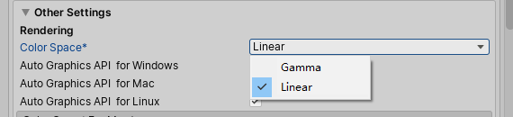

# Gamma矫正
---

## 一、Gamma

1. 详细解释参考[这里](https://learnopengl-cn.github.io/05%20Advanced%20Lighting/02%20Gamma%20Correction/)

2. 早期CRT显示器电压输入和输出关系是幂律曲线

3. 人眼对颜色的变化敏感度实际上受环境光的影响（图1）

4. 由于普通情况下我们对显示器暗部色彩的变化更加敏感，所以早期大厂定义了[sRGB色彩标准](https://en.wikipedia.org/wiki/SRGB)，在当时存储数据小的情况下用更多的暗部数据来表现细节。图像数据保存在设备上实际是经过了gamma=0.45计算的，最后经过gamma=2.2输出到屏幕上，对用户来说是无感知的（图2）

5. 由于纹理基本是在sRGB空间下进行创建于保存，当一些高级算法需要对纹理数据在线性空间下进行计算时，会出现明显的偏色问题，所以程序都需要处理输入与输出两个地方的转换

*图1. 上下两张图灰阶色值相同，但因为背景颜色不一样导致人眼对两张图的亮度变化感受也不一样*

*图2. From [Uncharted 2: HDR Lighting](https://www.gdcvault.com/play/1012351/Uncharted-2-HDR) By NaughtyDog*

## 二、应用层

当前的引擎或图形API都提供了自动转换到线性空间的选项，一般不必太追究具体转换过程，只需要保证输入与输出对应。

比如Unity中提供了color space选项，当选择linear时，会自动将纹理从sRGB转到线性空间，输出钱转到gamma空间，开发者只要保证所用纹理都是sRGB格式即可（非sRGB需要手动设置一下格式）

对于OpenGL，以及ES3之后

* 输入：创建纹理时，[glTexImage2D](http://docs.gl/es3/glTexImage2D)方法提供了GL_SRGB和GL_SRGB_ALPHA两种纹理格式，GL会自动把在读取sRGB纹理后把其转到线性空间

* 输出：开启[glEnable(GL_FRAMEBUFFER_SRGB)](http://docs.gl/es3/glEnable)，在Fragment输出，写入framebuffer之前，硬件会自动矫正

* 太古老的硬件OpenGL版本里，如ES2是不支持sRGB格式的，如果硬件支持EXT扩展，可以看是否支持[EXT_texture_sRGB](https://www.khronos.org/registry/OpenGL/extensions/EXT/EXT_texture_sRGB.txt)，或者手动在输入输出时转换

而在DX中，以DX11举例，创建各类资源时都提供了格式供选择，比如纹理资源格式[D3DX11_FILTER_SRGB](https://docs.microsoft.com/en-us/windows/win32/direct3d11/d3dx11-filter-flag)和framebuffer格式[DXGI_FORMAT_R8G8B8A8_UNORM_SRGB](https://docs.microsoft.com/en-us/windows/win32/api/dxgiformat/ne-dxgiformat-dxgi_format)，对应了输入输出的自动转换