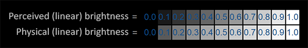

# Gamma矫正
---

## 一、Gamma

1. 详细解释参考[这里](https://learnopengl-cn.github.io/05%20Advanced%20Lighting/02%20Gamma%20Correction/)

2. 早期CRT显示器电压输入和输出关系是幂律曲线

3. 人眼对颜色的变化敏感度实际上受环境光的影响（图1）

4. 由于普通情况下我们对显示器暗部色彩的变化更加敏感，所以早期大厂定义了[sRGB色彩标准](https://en.wikipedia.org/wiki/SRGB)，在当时存储数据小的情况下用更多的暗部数据来表现细节。图像数据保存在设备上实际是经过了gamma=0.45计算的，最后经过gamma=2.2输出到屏幕上，对用户来说是无感知的（图2）

*图1. 上下两张图灰阶色值相同，但因为背景颜色不一样导致人眼对两张图的亮度变化感受也不一样*

*图2. From [Uncharted 2: HDR Lighting](https://www.gdcvault.com/play/1012351/Uncharted-2-HDR) By NaughtyDog*

## 二、矫正

1. 由于纹理基本是在sRGB空间下进行创建于保存，当一些高级算法需要对纹理数据在线性空间下进行计算时，会出现明显的偏色问题。程序中一般需要处理两个地方

2. 输入：OpenGL ES3之后的[glTexImage2D](http://docs.gl/es3/glTexImage2D)方法提供了GL_SRGB和GL_SRGB_ALPHA两种纹理格式，GL会自动把在读取sRGB纹理后把其转到线性空间

3. 输出：进行线性计算后如果要输出到帧缓冲显示到屏幕上，需要重新把数据重新变回到gamma空间，这样图像再次经过显示器次幂转换，就能在屏幕上显示正确的颜色。在OpenGL里开启glEnable(GL_FRAMEBUFFER_SRGB)来实现