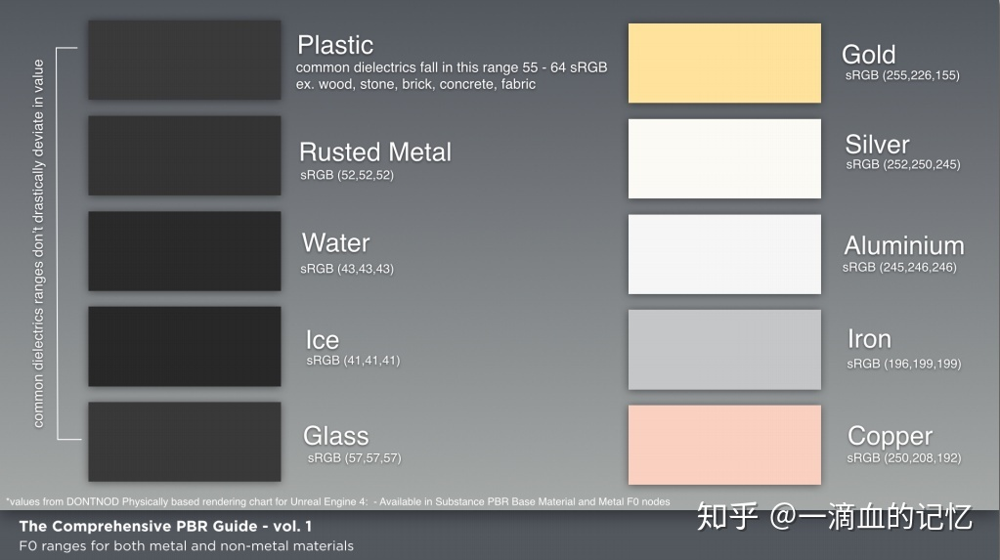

# PBR(临时未整理)

---

## 资料

[Substance The-PBR-Guide](https://academy.substance3d.com/courses/the-pbr-guide-part-1)
[基于物理的渲染（PBR）白皮书](https://zhuanlan.zhihu.com/p/53086060)
[猴子都能看懂的PBR](https://zhuanlan.zhihu.com/p/33464301)
[OpenGL PBR](https://learnopengl-cn.github.io/07%20PBR/01%20Theory/)
[Cook-Torrance的BRDF模型](https://blog.csdn.net/qq_39300235/article/details/105451795)

---

## 菲涅尔反射

光线以不同角度入射会有不同的反射率。相同的入射角度，不同的物质也会有不同的反射率。万物皆有菲涅尔反射。F0是即0度角入射的菲涅尔反射值。**大多数非金属的F0范围是0.02~0.04，大多数金属的F0范围是0.7~1.0**。

---

## 物质的光学特性

**这条可以和上方的菲涅尔性质联系起来学习。**

现实世界中有不同类型的物质可分为三大类：绝缘体（Insulators），半导体（semi-conductors）和导体（conductors）。在渲染和游戏领域，我们一般只对其中的两个感兴趣：导体（金属）和绝缘体（电解质，非金属）金属大多比绝缘体更容易发生镜面反射。导体一般的镜面反射率高达60-90%，而绝缘体一般在0-20%的范围。这种高反射率阻止了大部分光到达其内部产生散射，使得金属看起来很闪亮。 其次，导体的反射率在可见光谱中呈现多样变化，使得它们的反射光具有颜色（白光照射下）。尽管反射光具有颜色很奇怪，但确实在我们日常的材质中出现（比如，金、铜和黄铜）。绝缘体大部分情况下不会呈现出这种效果，它们的反射光的颜色是一般跟光源颜色一致。 最后，导体通常对进入其表面的光是吸收而不是散射。这意味着理论上导体不会表现出任何的漫反射，但实际中由于金属表面氧化等原因，还是会表现出部分散射效果，下面的方程式中的lerp插值也能说明这点。

非金属具有单色/灰色镜面反射颜色。而金属具有彩色的镜面反射颜色。即非金属的F0是一个float。而金属的F0是一个float3，如下图。

转化成0-1之间的数值表示：

水: (0.02, 0.02, 0.02)

塑料: (0.03, 0.03, 0.03)

玻璃: (0.02, 0.02, 0.02)

金: (1.00, 0.71, 0.29)

铝: (0.91, 0.92, 0.92)

铁: (0.56, 0.57, 0.58)

可以看出，非金属的反射率都非常小，而金属的反射率都比较高。大部分在0.5以上。RGB三个通道的值代表着反射出的亮度的强弱，值越大，则金属越"亮"。所以对于金属而言，我们可以采用统一的一个比较小的数值来模拟，反正差距也不是很大。对于Unity引擎里而言采用的就是一个定值常数（0.04,0.04,0.04），而对于金属来说，我们以金属自身的颜色Albedo作为它的值。而金属表面氧化以后的散射效果则需要在非金属和金属之间插值获得。所以我们做3D渲染的时候，一个像素面积内是可能同时包含金属和非金属的。为了准确描述这种现象，我们定义一个值叫做“金属度”，当它为1时，反射率完全按金属的方式处理，为0时，完全按非金属的方式处理。当取值在0和1之间时，通过线性插值确定反射率：

$$
F_0 = Metalic\times Albedo+(1-Matalic)\times[0.04, 0.04, 0.04]
$$

---